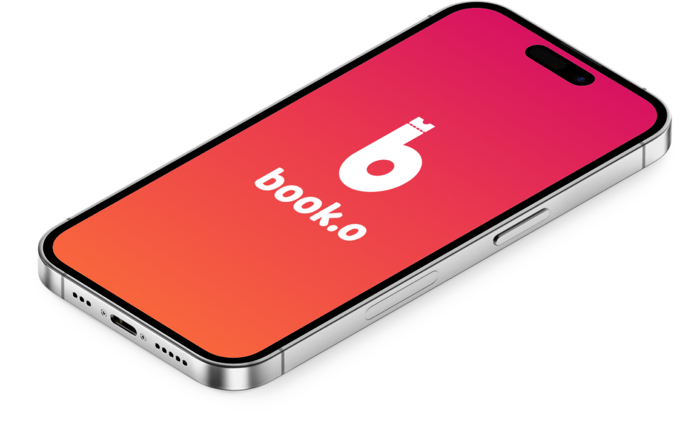

# Book.o - Movie Ticketing System



Developed using Flutter and Firebase with Bloc and Cubit state management, Book.o is a movie ticketing system that allows users to search for movies, reserve seats, and generate unique QR codes for ticket verification at the theater entrance.

This project is for our Mobile Development subject.

## Features

### Ticket QR Code Generator

- Generate unique QR codes for each purchased movie ticket, allowing easy scanning and verification at the theater entrance.

### Seat Reservation

- Select and reserve the preferred seats for a specific movie showtime, ensuring a seamless and personalized movie-going experience.

### Movie Search and Filtering

- Provide users with the ability to search for upcoming and now showing movies, with options to filter by genre, release date, rating, and more.

---

## Development and Testing

For development and testing purposes, you can run the Book.o app on your local machine using the following steps:

1. Install Flutter: If you haven't already, install Flutter by following the instructions in the [Flutter documentation](https://flutter.dev/docs/get-started/install).

2. Clone the repository: Clone the Book.o repository to your local machine using the following command:
	```
	git clone https://github.com/your-username/Book.o.git
	```

3. Navigate to the project directory: Use the `cd` command to navigate to the project directory:
	```
	cd Booko
	```

4. Install dependencies: Run the following command to install the project dependencies:
	```
	flutter pub get
	```

5. Connect your mobile device or emulator: Connect your mobile device to your computer using a USB cable or start an emulator. Make sure that your device is connected and recognized by your computer.

6. Run the app: Run the following command to start the app on your connected mobile device:
	```
	flutter run
	```

	This will launch the app on your mobile device, and you can interact with it for testing and development purposes.

7. Make code changes and test: Make any necessary code changes and test the app on your mobile device. The changes will be reflected in real-time on the device.
